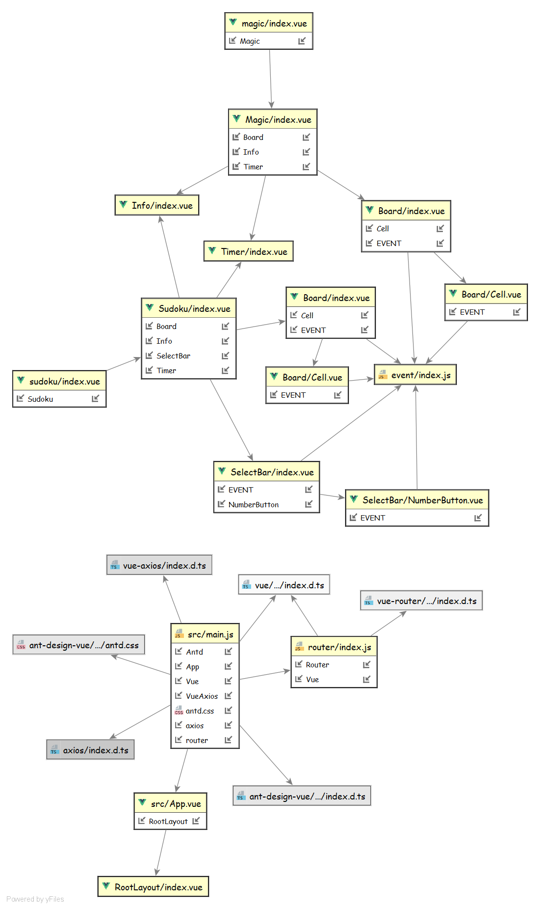
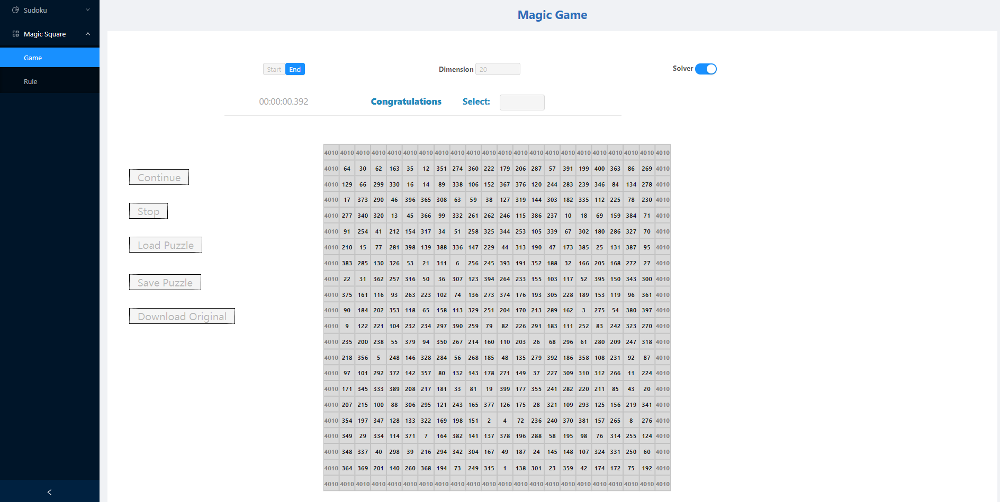

# GUI Design Document

**Team Name**: Magic Square No Magic
| Name   | SID      |
| ------ | -------- |
| 聂秋实 | 11813207 |
| 阮业淳 | 11812109 |
| 张宏彬 | 11810820 |
| 张韶丰 | 11811522 |
| 黎诗龙 | 11811407 |
| 高圣迪 | 11811405 |

## Structure

### Directory Tree

```bash
src
├── App.vue
├── assets
│   └── logo.png
├── components
│   ├── event
│   │   └── index.js
│   ├── HelloWorld.vue
│   ├── Info
│   │   └── index.vue
│   ├── Magic
│   │   ├── components
│   │   │   └── Board
│   │   │       ├── Cell.vue
│   │   │       └── index.vue
│   │   └── index.vue
│   ├── RootLayout
│   │   └── index.vue
│   ├── Sudoku
│   │   ├── components
│   │   │   ├── Board
│   │   │   │   ├── Cell.vue
│   │   │   │   └── index.vue
│   │   │   └── SelectBar
│   │   │       ├── index.vue
│   │   │       └── NumberButton.vue
│   │   └── index.vue
│   └── Timer
│       └── index.vue
├── main.js
├── page
│   ├── magic
│   │   └── index.vue
│   ├── mrule
│   │   └── index.vue
│   ├── srule
│   │   └── index.vue
│   └── sudoku
│       └── index.vue
└── router
    └── index.js
```

### UML



## Techinical Stack
- Vue.js
- Websocket
- Axios
- Ant Ddesign


## Features
- Seperation of back end and front end
- RESTful API
- Artistic and easy to access
- Real-time interaction between back end and front end
- Customized logo

## Core Components
- `Timer`: Recording time for the solving process.
- `Info`: Messages during the game and after the game is completed.
- `Magic`: Necessary magic square elements.
- `RootLayout`: The layout of the whole front end.
- `Sudoku`: Necessary sudoku elements.

## UI

### Magic Square


### Magic Rule


### Sudoku


### Sudoku Rule


## Acknowledgement
Thanks to [17881055/vue-sudoku](https://github.com/17881055/vue-sudoku). Our work is based on this repository.